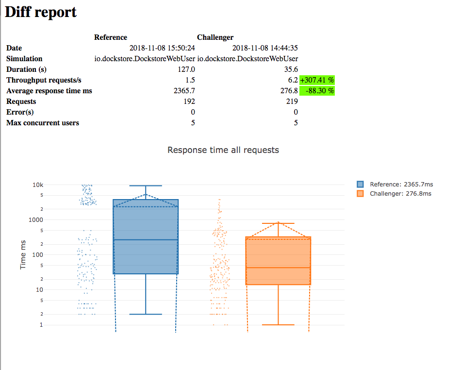

[](https://travis-ci.org/dockstore/dockstore-load-tester.svg?branch=master)

# dockstore-load-tester
Dockstore Load/Performance/Stress Tester

## Running the tests

### Setup

#### Tokens
In `io.dockstore.DockstoreSimulation`, tokens are randomly fed in so that requests
are made from different users. The tokens are read from `data/tokens.csv`. For both security
reasons and because different instances of Dockstore will have different token values,
no token values are checked into `tokens.csv`.

The `tokens.csv` value should have at least one token, and can have as many tokens as you
wish. The Gatling "feeder" randomly extracts a token for each simulated user and
makes if available. Because the token is randomly selected and because there might
be more simulated users than tokens, the same token can get inserted more than once. If
you want to simulate more unique users, add more tokens.

Update `data/tokens.csv`, adding **at least one** Dockstore token. Each token
should be a valid token for the Dockstore endpoint you are hitting. Each token should
be on its own line. Make sure to leave the existing title line `token`, as that is the
variable name that tests will use to access the randomly injected token. Do not check changes
to the tokens.csv file for the reasons discussed in the first paragraph.
```csv
token
4b9f337371353f3919dbed3d1b007f0ff257d2e9d30f333f9954f2ff3fd3354b
2b9f337371353f3919daaa3d1b007f0ff257d2e9d30f333f9954f2ff3fd335c3
1b9f337371353f3919dbbb3d1b007f0ff257d2e9d30f333f9954f2ff3fd3355d
anonymous
```
To simulate anonymous users, add the literal string `anonymous`. Add it multiple times if you want to increase the
ratio of anonymous to authenticated users. In the above example, ~25% of the calls will be made by an anonymous user; if you want
~50% of the calls made by an anonymous user, add `anonymous` 2 more times, which would make 3 of the 6 tokens anonymous.

#### Endpoints

`io.dockstore.HttpProtocols` has various Dockstore endpoints defined.

### Run

You can configure the following properties with `-D`, e.g., `-Dusers=50`:

* users -- the number of users to simulate; defaults to 20
* atOnce -- true if all users should hit at once, or if they should ramp up over time; defaults to true
* rampMinutes -- if `atOnce` is not true, the number of minutes the specified number of users will be phased in
* baseUrl -- the Dockstore webservice endpoint to run the tests against; defaults to `http://localhost:8080`
* scenario -- the name of the scenario to run; see DockstoreWebUser.scala for all available; defaults to `Everything`, which runs (almost) everything
* maxResponseTimeMs -- if any API call takes longer than this, simulation will fail; default is 10,000, which is probably too low
* successThreshold -- the precentage of calls that should pass; if less, the simulation fails; default is 95

Regarding the last two items, the tests will still run to completion; there will a message at the end saying the tests failed.

The default values are defined in the `<properties>` section of the pom.xml.

```bash
mvn clean test-compile gatling:test
```

#### Results

At the end of the run, the output location will be displayed, that you can open in a browser, e.g.,

```bash
Please open the following file: /Users/charlesoverbeck/git/dockstore/dockstore-load-tester/target/gatling/dockstorewebuser-20181108213044663/index.html
```

The directory with the index.html file also has a `simulation.log` file, which has the raw data, if you wish to look at it in a non-GUI
format.

### Comparing Results

The GitHub release has a gatling-report-3.0 JAR that you can use to compare different runs.

```java
java -jar gatling-report-3.0-SNAPSHOT-capsule-fat.jar target/gatling/dockstorewebuser-20181109062654032/simulation.log \
    target/gatling/dockstorewebuser-20181113210759185/simulation.log \
    -o newdirectory
```

This will generate a newdirectory/index.html file, which you can open in the browser to get a view like this .

#### Where the JAR came from, and why

The JAR is built locally from 
[https://github.com/coverbeck/gatling-report/tree/gatling_3_0_support](https://github.com/coverbeck/gatling-report/tree/gatling_3_0_support),
a fork of [https://github.com/nuxeo/gatling-report](https://github.com/nuxeo/gatling-report). It is forked because
the nuxeo code currently does not work with Gatling 3.0 simulation.log files. A [PR](https://github.com/nuxeo/gatling-report/pull/14) has
been submitted to fix this, but until it is merged and an "official" release can be downloaded, we are attaching the binary to the
GitHub Release.

Alternatively, you can clone [https://github.com/coverbeck/gatling-report](https://github.com/coverbeck/gatling-report), checkout
the gatling_3_0_support branch, run `mvn clean package`, and use the generated JAR. 

## Tips

Figuring JSON paths can be tricky. I find [this site](http://jsonpath.herokuapp.com/) useful in interactively figuring out the
expression.

## Todo

1. Configurably set Gatling `.disableCaching` parameter.
   1. For simulating web users, I assume the caching is done
on a per-user basis, which is what we would want, as the browser would cache requests based on headers. Need to verify.
   2. For simulating API calls, we probably want to disable caching, as HTTP client libraries don't do that, AFAIK.
1. SearchPage only searches one term, author. Ideally would do more complex searches.
1. Doesn't test integration with external repos, e.g., refreshing from GitHub
1. Add checks for things that take too long. This is done globally and is configurable, but should maybe add checks
for certain key APIs.
1. Figure out creating hosted tools test. Problem is that I cannot generate a unique name for the tools like I can for workflows.
1. A lot of endpoints are not tested. See Requests.scala -- all the paths that are commented out are not tested.
1. Current simulation, DockstoreWebUser.scala, more or less simulates the calls a web user would make by
visiting various Dockstore web pages. There are other simulations we should consider modeling
    1. Scripts or other programmatic access to the API
    1. Emulate how Broad UI might access Dockstore
    1. ??? 

